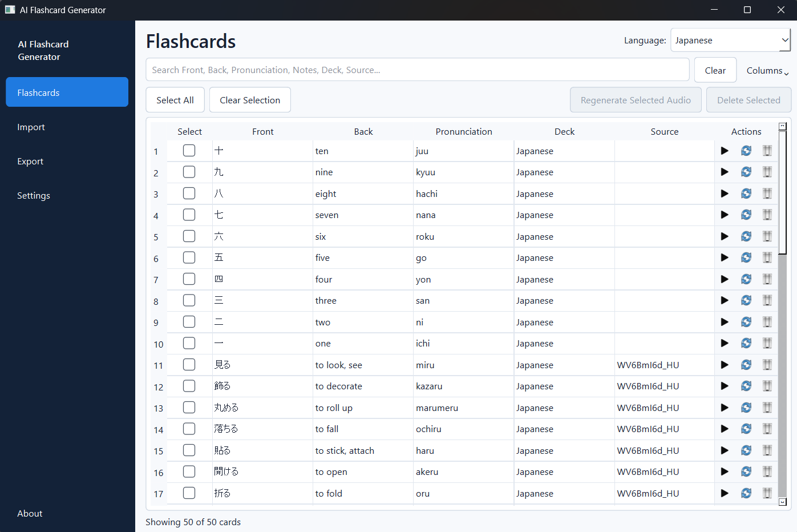
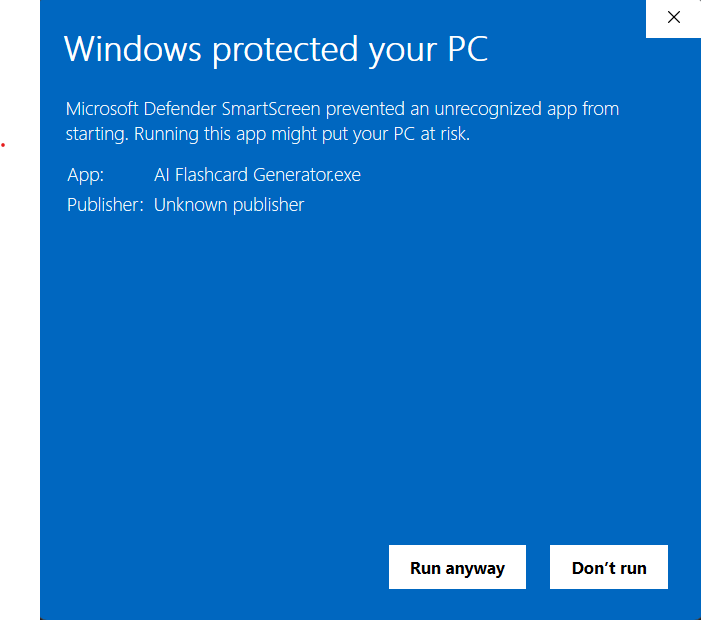
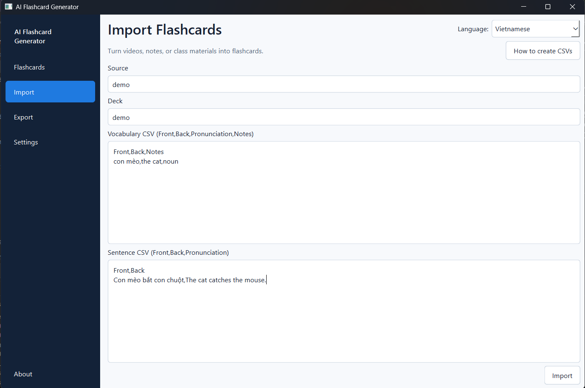
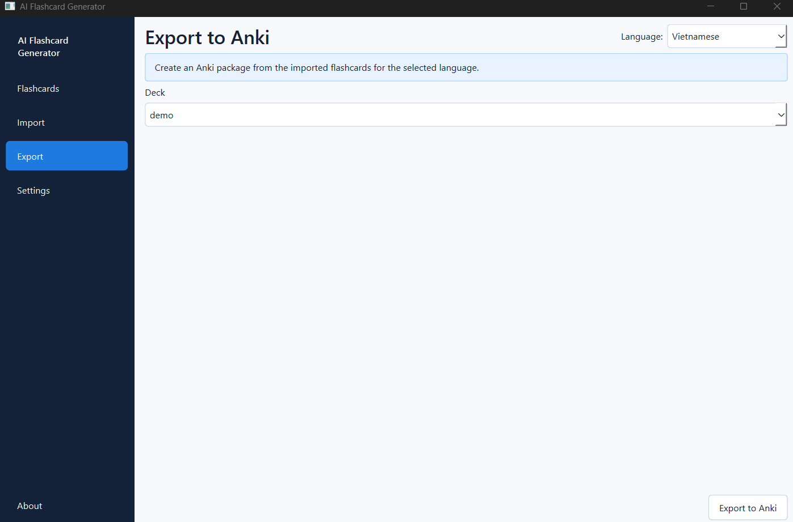
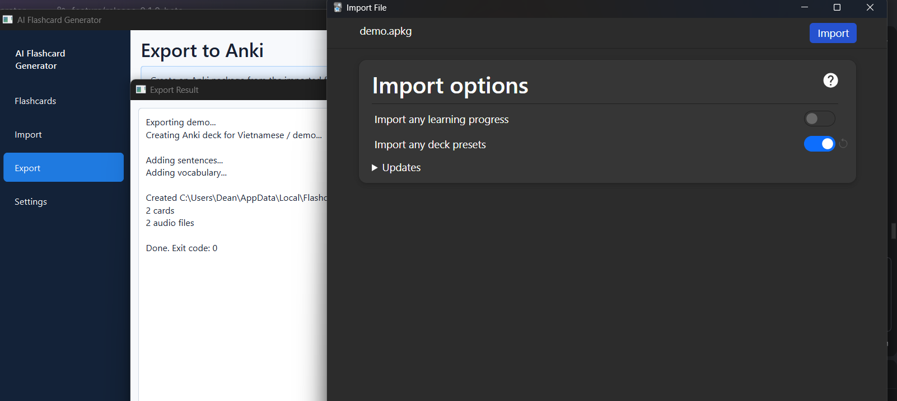
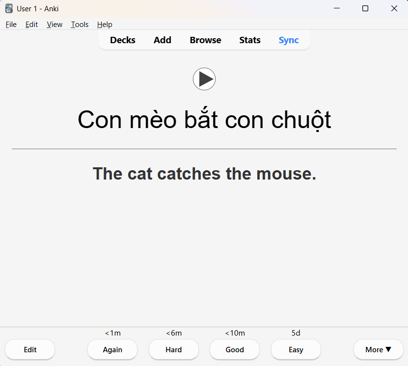
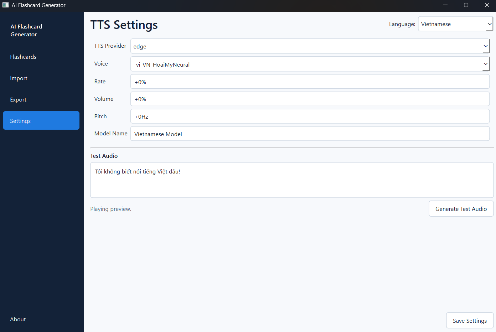

# AI Flashcard Generator

Generate Anki flashcards with high-quality AI-generated audio.

AI Flashcard Generator is a desktop application that helps you create Anki decks with natural-sounding text-to-speech audio. Import your own vocabulary or sentence lists, generate audio using AI, and export everything as an Anki deck.

> ⚠️ This is an early beta release. Feedback, bug reports, and suggestions are always welcome.

---

## Features

- Generate Anki flashcards from vocabulary and sentence CSV files
- High-quality AI-generated audio for multiple languages
- Support for OpenAI, Edge TTS, and FPT.AI text-to-speech providers
- Store flashcards in a local SQLite database
- Browse, search, edit, and delete flashcards
- Regenerate audio at any time
- Export directly to Anki (`.apkg`)
- Support for multiple languages and decks




---

# Getting Started

## Download

Download the latest Windows release:

https://github.com/EasyTarget57/ai-flashcard-generator/releases/download/v0.1.1-beta/AI-Flashcard-Generator-windows.zip

## Installation

1. Download the ZIP file.
2. Extract it.
3. (Optional) Move the extracted folder to your preferred location.
4. Open the folder.
5. Double-click **AI Flashcard Generator.exe**.

### Windows Defender Warning

Because the application is currently unsigned, Windows Defender will display a security warning the first time you run it.

This is expected. Code signing certificates are expensive, so they are not currently used for this hobby project.

Click **More info** → **Run anyway** to start the application.



---

# Usage

Run the application by either:

- launching **AI Flashcard Generator.exe**, or
- clone the project and start with python (see development section)

Select the language you want to work with using the language selector in the top-right corner of the application.

## Flashcards


The **Flashcards** page lets you browse, search, and manage all flashcards stored in the local database.

### Available actions

- ▶️ **Play audio** for a flashcard.
- 🔄 **Regenerate audio** for one or more selected flashcards.
- 🗑️ **Delete** one or more selected flashcards.

You can select multiple flashcards and use the toolbar buttons to regenerate or delete them in a single operation.

### Notes

- Deleting a flashcard removes it from this application and future Anki exports. Existing copies in Anki are **not** deleted automatically and must be removed manually. This behavior is intentional and prevents accidental data loss in Anki.
- You can copy cell contents using **Ctrl+C**. Double-clicking a cell does not highlight its text.

---

## Import



The **Import** page is used to create new flashcards from vocabulary and sentence CSV files.

Paste the contents of your CSV files into the appropriate text boxes and click **Import**. The application generates audio for every flashcard and stores everything in the local database.

### Import options

At the top of the page you can configure:

- **Deck Name** – The name of the Anki deck that will be created during export. If left empty, the language name is used.
- **Source** *(optional)* – A label such as a YouTube video, textbook chapter, or lesson name. This makes it easy to find related flashcards later.

The first row of each CSV must contain the column names shown in the examples below.

Need help creating CSV files? Click **How to create CSVs** in the top-right corner. The guide explains how to use ChatGPT or other AI tools to generate correctly formatted CSV files.

> **Note:** The import workflow will be simplified in future releases.

### Vocabulary CSV (`vocabulary.csv`)

Example for Japanese:

```csv
Front,Back,Pronunciation,Notes
ハサミ,scissors,hasami,noun
紙,paper,kami,noun
```

Example for Vietnamese (no pronunciation):

```csv
Front,Back,Notes
cái kéo,scissors,noun
tờ giấy,paper,noun
```

### Sentences CSV (`sentences.csv`)

Example for Japanese:

```csv
Front,Back,Pronunciation
これは何ですか。,What is this?,Kore wa nan desu ka?
わかりません。,I don't know.,Wakarimasen.
```

Example for Spanish (no pronunciation):

```csv
Front,Back
¿Qué es esto?,What is this?
No sé.,I don't know.
```

---

## Export



The **Export** page creates an Anki deck (`.apkg`) from the flashcards stored in the selected deck.

> **Important:** Close Anki before exporting. If Anki is already running, the generated deck cannot be opened automatically after export.

To export a deck:

1. Select the deck from the list.
2. Click **Export to Anki**.



When the export is complete, the application automatically opens the generated deck in Anki (if Anki is not already running).



After importing the deck into Anki:

- The front of each card displays the target language text and automatically plays the audio.
- The back of the card displays the translation.
- If a **Pronunciation** column was included during import, it is also shown on the back of the card.

---

## Settings



The **Settings** page allows you to configure the text-to-speech (TTS) provider for each language.

Currently supported providers are:

- **Edge TTS** *(free)*
- **OpenAI**
- **FPT.AI**

OpenAI and FPT.AI require an API key configured as an environment variable.

To verify your configuration:

1. Enter some text in the target language.
2. Click **Generate Test Audio**.
3. If the result sounds correct, click **Save Settings**.

For Edge TTS you can simply choose a voice from the dropdown list.

For OpenAI and FPT.AI, select the desired voice according to the provider's documentation.


Example configuration for FPT.AI.

# Requirements

## 1. Anki

This application currently exports flashcards only to Anki, so Anki Desktop must be installed.

https://apps.ankiweb.net/

## 2. API Keys (Optional)

Some text-to-speech providers require an API key.

### OpenAI

Languages that use OpenAI TTS require the following environment variable:

```text
OPENAI_API_KEY
```

### Vietnamese (FPT.AI)

Vietnamese audio uses FPT.AI.

Copy your API key from the
[FPT Marketplace API Keys page](https://marketplace.fptcloud.com/en/my-account?tab=my-api-key)
and set the following environment variable:

```text
FPTAI_API_KEY
```

---

# Development

The application stores user data outside the project directory using `platformdirs`.

On Windows this is typically:

```text
C:\Users\<your username>\AppData\Local\FlashcardGenerator\
```

## Important files and folders

```text
flashcards.db         SQLite database
input\                Temporary CSV files used during import
audio\<language>\     Generated audio files
output\<language>\    Generated Anki (.apkg) files
```

## Running the application

```bash
python flashcard-generator.py
```

## Project structure

Most of the implementation lives in the `lib/` directory.

| File | Description |
|------|-------------|
| `lib/db.py` | Database initialization and schema migrations |
| `lib/decks.py` | Deck creation, lookup, and migration helpers |
| `lib/import_cards.py` | CSV import and audio generation |
| `lib/export_anki.py` | Anki `.apkg` export |
| `lib/tts_providers.py` | OpenAI, Edge TTS, and FPT.AI integrations |
| `lib/paths.py` | Project and user-data paths |

## Database

The application uses three main tables:

| Table | Purpose |
|-------|----------|
| `language_configuration` | Language settings such as display name, TTS provider, voice, and Anki model |
| `decks` | Decks within a language (case-insensitive per language) |
| `flashcards` | Flashcards, translations, notes, source, audio filename, test flag, and `deck_id` |

## Installing dependencies

Runtime dependencies:

```bash
pip install -r requirements.txt
```

Development dependencies:

```bash
pip install -r requirements-dev.txt
```

`requirements-dev.txt` contains tools required to build the Windows executable, including PyInstaller and Pillow.

---

# Roadmap

Planned improvements include:

- Fix audio playback when the output device changes
- Import flashcards directly from YouTube videos
- Import flashcards from PDF and Word documents
- Export to Quizlet